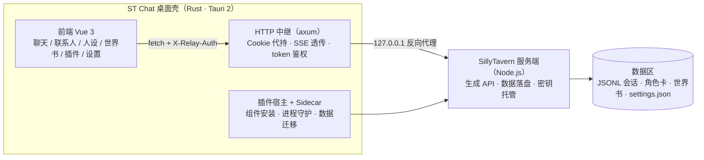

<div align="center">

# ST Chat

**把 SillyTavern 装进一个桌面聊天应用**

类微信三栏界面的 SillyTavern 桌面客户端 —— 内部托管原版 SillyTavern 服务端，
数据与 ST 网页端完全互通：同一份角色卡、会话、世界书，双端随时切换使用。


</div>

---

## 这是什么

[ST Chat](https://github.com/Steven-DD/SillyTavern-OpenChat) 是
[SillyTavern](https://github.com/SillyTavern/SillyTavern)（1.19.0）的桌面化重实现，
由三层组成：

- **桌面壳（Rust · Tauri 2）**：托管 SillyTavern 服务端子进程（sidecar）、
  本机环回反向代理（会话 Cookie 代持 + SSE 无缓冲透传 + 一次性 token 鉴权）、
  Node / SillyTavern / Git 组件的版本化安装与数据区迁移；
- **前端（Vue 3 + Pinia）**：重新实现 ST 网页端的聊天前端逻辑 ——
  提示词组装、世界书注入管线、宏、各生成源适配等，界面为类微信三栏布局；
- **服务端（Node.js）**：原版 SillyTavern，不做魔改 —— 数据格式因此天然互通。

## 功能一览

**聊天主链路**
- 流式生成 / 停止（保留已生成部分）/ 重新生成 / Swipe 备选 / 消息编辑 · 删除 · 重发
- Continue 续写、Impersonate 代写、auto-continue 自动续写（真实 token 计数门槛）
- 消息分支 / 书签、会话全文搜索、置顶与别名、消息隐藏、`/sys` 旁白

**生成源**
- Chat Completion 24 源（Claude / Gemini / OpenRouter / DeepSeek / Vertex AI / Azure 等）
- Text Completion 15 后端 + NovelAI + Horde
- 采样参数全量暴露，并与 ST `settings.json` 双向同步防打架
- Token 计数三级兜底（SSE 实测 → 远程精确 → 本地估算）、用量与费用统计

**角色与世界观**
- 角色卡管理：PNG / JSON / charx 导入导出，内嵌世界书自动导入绑定
- 世界书：全字段条目编辑器 + 完整注入管线（关键词 / 正则 / selective 四逻辑 /
  递归扫描 / sticky·cooldown·delay / 预算控制）
- Persona 管理与锁定、作者注释 @Depth 注入、Prompt Manager（三槽 + prompt_order）
- Summarize 总结记忆 + Vectors 向量检索注入

**群聊**
- 与 ST 群聊数据文件完全互通；NATURAL / LIST / MANUAL / POOLED 四种激活策略
- talkativeness 掷骰、@mentions 优先激活、自动发言延时、手动静音、群头像上传

**扩展体系**
- 宏系统（55+ 宏、块级 if、变量与 `chat_metadata` 互通）+ STscript 命令子集
- 正则脚本、快捷回复（与 ST 套装文件互通）、表情立绘、消息翻译、TTS 朗读
- 数据维护：巡检报告、选择性清理、批量操作

## 架构



中继只监听 `127.0.0.1` 随机端口；除浏览器 `` 无法携带自定义头的静态资源 GET 外，
所有请求必须携带启动期下发的随机 token（`X-Relay-Auth`），CORS 仅对应用自身来源放行。

## 数据互通

App 沿用 SillyTavern 标准数据目录结构（角色卡、JSONL 会话、世界书、`settings.json`、
群聊文件、`chat_metadata` 等），**不做私有格式**：

- 在 ST 网页端和 App 之间切换，看到的是同一份角色与聊天记录；
- 会话级状态（人设锁、作者注释、摘要、宏变量、timedWorldInfo）直接读写
  `chat_metadata`，与网页端互通；
- 组件安装器把 Node / SillyTavern / Git 安装在版本化目录中，数据区独立于安装目录，
  升级 / 重装不丢数据。

## 快速开始

### 环境要求

- Windows 10 / 11（当前仅打包 NSIS 安装包）
- [Node.js](https://nodejs.org/) ≥ 20（构建前端用；运行时的 Node 由应用托管）
- [Rust](https://rustup.rs/) stable（MSVC 工具链）

### 构建运行

```bash
git clone git@github.com:Steven-DD/SillyTavern-OpenChat.git
cd SillyTavern-OpenChat
npm install

npm run tauri dev     # 开发运行：桌面壳 + 前端热更新（首次启动引导安装 ST 组件）
npm run tauri build   # 产出 NSIS 安装包（src-tauri/target/release/bundle/nsis/）
```

### 仅调试前端（浏览器）

```bash
# 在仓库目录的上一级准备一份 SillyTavern（供 scripts/st-dev.mjs 拉起）
git clone --depth 1 --branch release https://github.com/SillyTavern/SillyTavern.git ../SillyTavern

npm run st     # 拉起 ST 服务端（127.0.0.1:8000，纯后端模式）
npm run dev    # 浏览器打开 http://127.0.0.1:1420，经 Vite 代理访问 ST
```

Windows 下也可用根目录的 `dev-start.bat` / `dev-stop.bat` 一键启停完整桌面开发环境
（自动防重复启动，日志写入 `dev-run.log`）。

## 测试

```bash
npm run typecheck                                # vue-tsc 类型检查
npm run build                                    # 类型检查 + 生产构建
cargo test --manifest-path src-tauri/Cargo.toml  # Rust 单测 + 中继/插件宿主 e2e
npm run relay-test                               # 中继 e2e（含对真实 ST 的验证）
```

`scripts/selfcheck-*.mjs` 为各功能模块的回归自检脚本（宏、正则、群聊编排、
Instruct、textgen 等）。

## 安全设计

- **网络面**：ST 与中继均只绑定本机环回；中继对每个请求校验一次性随机 token，
  本机其它进程与浏览器网页无法借道访问 ST（含密钥接口）。
- **密钥**：所有上游 API Key 经 ST `/api/secrets` 由服务端加密托管，前端不落盘。
- **渲染**：AI 消息 Markdown 渲染走 sanitize 白名单，角色卡字段按纯文本处理。

## 许可证

[AGPL-3.0](https://www.gnu.org/licenses/agpl-3.0.html) —— 与上游
[SillyTavern](https://github.com/SillyTavern/SillyTavern) 同协议开源，感谢 ST 项目的优秀工作。
